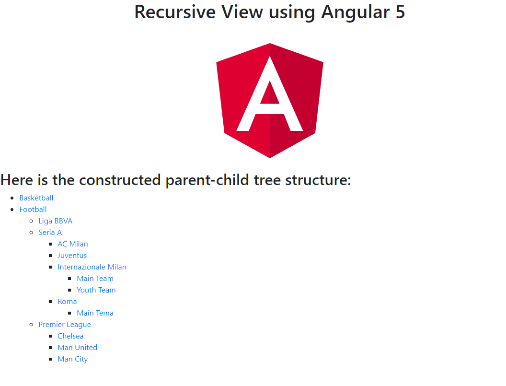

# NgxRecursiveView

An Angular 5 Basic project to illustrate how to build a recursive parent-child view.

## Development server

Run `ng serve` for a dev server. Navigate to `http://localhost:4200/`. The app will automatically reload if you change any of the source files.

## Build

Run `ng build` to build the project. The build artifacts will be stored in the `dist/` directory. Use the `-prod` flag for a production build.

## Questions
If you have any questions please use the Issues tab or submit a pull request. 

## Contributors
[@ilirhushi](http://ilirhushi.me)
